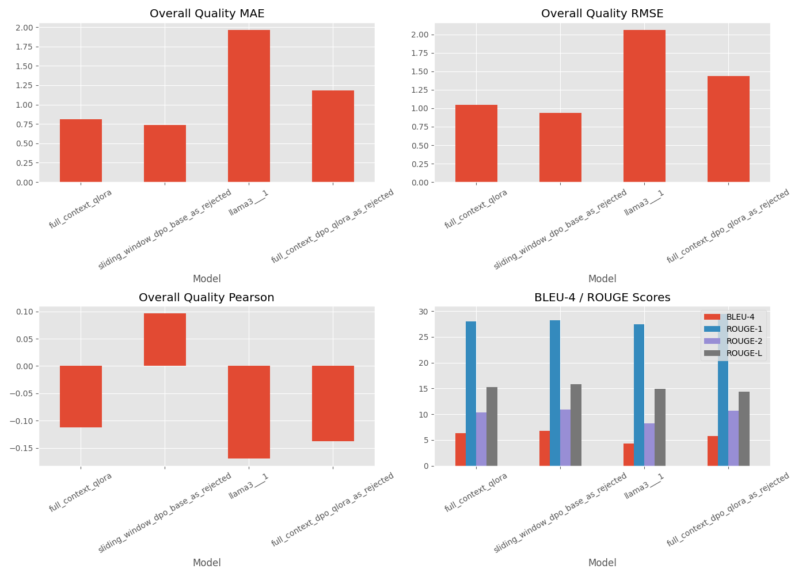

# 基于LLM的自动化同行评审系统

这是 [NYU CSCIGA 2565](https://cs.nyu.edu/courses/spring25/CSCI-GA.2565-001/) 的课程项目。在该项目中,我们对 [Llama-3.1-8B-Instruct](https://huggingface.co/meta-llama/Llama-3.1-8B-Instruct) 进行了微调,用于评审研究论文。


### 数据准备

- 我们从 OpenReview 爬取了顶级会议(如 ICML、NIPS、ICLR、CVPR)的论文及其评审。数据集已发布在 Hugging Face 并公开:
  - [数据集(原始)](https://huggingface.co/datasets/guochenmeinian/openreview)
  - [数据集(可用于训练)](https://huggingface.co/datasets/guochenmeinian/openreview_dataset)

- 我们使用 [Nougat-OCR](https://github.com/facebookresearch/nougat) 来解析 PDF。这是我找到的一份 [使用指南](https://github.com/ad17171717/YouTube-Tutorials/blob/main/Machine%20Learning%20with%20Python/Optical_Character_Recognition_(OCR)_with_Meta's_Nougat!.ipynb)。基于原始数据集,我们使用 GPT-4-mini 对评审进行格式化/合并,为训练准备数据。

以下是我们为训练准备的结构化输出示例:
```markdown
### Key Points
This paper presents an online learning framework for Markov Decision Processes (MDPs) with countably infinite states, utilizing a Bayesian perspective where MDP parameters follow a prior distribution. The authors propose a Thompson-sampling-like approach to solve the MDP, assuming access to an optimal policy oracle. The learning goal is Bayesian regret minimization, achieving a regret bound of \(\sqrt{TA}\) under certain assumptions. The paper contributes to theoretical reinforcement learning by providing near-optimal algorithms for unbounded state spaces and includes empirical simulations demonstrating the algorithm's performance.

### Strengths and Weaknesses
Strengths:
- The model exhibits high generality and contributes significantly to theoretical reinforcement learning.
- The combination of Lyapunov analysis with existing proofs offers valuable insights for future research.
- The empirical simulations provide evidence supporting the algorithm's performance.
Weaknesses:
- The reliance on assumptions, particularly Assumption 3 regarding stability, may limit practical applicability and verification.
- The algorithm's dependence on an oracle for optimal policy solutions poses challenges for general queueing systems.
- The requirement to return to state 0 at the end of each episode could lead to impractical exponential dependencies.
- The paper lacks clarity in presenting constants related to theoretical results, which are crucial for practical performance.

### Suggestions for Improvement
We recommend that the authors improve the clarity of the assumptions, particularly Assumption 3, by discussing its implications for stability in more general systems. It would be beneficial to explore heuristics for designing the parameter and policy spaces to ensure this assumption holds. Additionally, we suggest testing the algorithm in more general systems and clarifying the necessity of the optimal policy oracle, possibly by presenting results in a comparative form against simpler policies like MaxWeight. The authors should also address the dependence of regret on system size and ensure consistent terminology by using either "queueing" or "queuing" throughout the paper. Finally, we advise revising the abstract for conciseness and improving the overall writing quality to enhance readability.

### Rating
Overall Quality: 6.2
Review Confidence: 3.2
```

---

### 模型训练

- 我们通过 [RunPod](https://www.runpod.io/) 在 **H100 GPU** 上使用 **QLoRA** 对 **LLaMA 3.1–8B-Instruct** 模型进行了微调。最初,我们利用 [LLaMA-Factory](https://github.com/hiyouga/LLaMA-Factory) 框架进行快速原型设计和实验。随着项目的推进,我们转而编写自己的训练和推理脚本,以更深入地理解:

  - 使用 **Hugging Face Transformers** 的模型加载和自定义
  - 使用 **QLoRA** 的内存高效训练
  - 使用 **Accelerate** 和 **DeepSpeed** 的分布式训练

  虽然我们尝试了使用 4×4090 的多GPU设置,但由于框架限制,我们发现大多数大上下文的前向传播(例如18k令牌)仍然需要单个GPU。我们的任务——结构化学术评审生成——需要为长输入序列提供高内存。因此,对于我们的设置,单个H100比使用多个较小的GPU更实用和稳定。

- 在使用QLoRA进行监督微调(SFT)后,我们致力于 **直接偏好优化**(DPO)以进一步使模型与人类偏好对齐。我们的想法是:虽然QLoRA教会模型复制结构化评审,但DPO将通过优化"好"和"坏"输出之间的偏好来推动模型偏好更高质量、结构更好的响应。我们的目标是比较不同来源的"被拒绝"输出如何影响模型偏好学习。具体来说,我们计划使用以下负面样本评估DPO结果:
  - **原始LLaMA 3.1输出**(零样本)
  - **QLoRA微调模型输出**

---

### 模型评估

我们使用 **评分预测指标** 和 **自然语言生成(NLG)指标** 评估了微调后的模型。我们的所有微调模型在这些指标上都超过了我们的基线LLama3.1模型。

#### 评分预测评估

我们基于预测的和真实的评分(评分部分下的整体质量)计算了 **MAE(平均绝对误差)**、**RMSE(均方根误差)** 和 **皮尔逊相关系数**。

- **MAE** 反映了样本间的 **平均预测偏差** — 预测值平均而言有多接近真实评分。
- **RMSE** 由于平方运算而强调 **大的预测误差** — 对离群值或严重错误更敏感。
- **皮尔逊相关系数** 测量预测评分和真实评分之间的 **线性关系** — 较高的相关性表明更好的趋势对齐。

我们同时考虑MAE和RMSE以更好地理解模型行为:

| 情况                | 解释                                 |
|---------------------|--------------------------------------|
| 低MAE, 低RMSE       | 准确且稳定的预测                     |
| 低MAE, 高RMSE       | 总体良好但有一些大错误               |
| 高MAE, 高RMSE       | 整体性能较差                         |

因此,这两个指标互补以评估整体质量和稳定性。

#### 自然语言生成评估

我们还使用了LLaMA-Factory中Hugging Face评估的标准生成指标:

- **BLEU-4**: 测量生成文本和参考文本之间的n-gram重叠。
- **ROUGE-1/ROUGE-2/ROUGE-L**: 测量生成文本和参考文本之间的一元组、二元组和最长公共子序列的重叠。

这些指标评估生成的评审相对于真实人类评审的 **流畅性、相关性和内容保留程度**。

通过结合 **基于评分的评估** 和 **生成质量评估**,我们希望全面评估模型生成忠实、信息丰富且结构化同行评审的能力。





### 实验观察

我们注意到:
- DPO确实提高了生成质量
- 基于QLoRA的DPO导致更有效的学习
当使用LLaMA3.1输出作为拒绝样本时,模型大部分时间显示几乎为零的损失——过于简单。然而,使用QLoRA输出作为拒绝样本时,DPO训练产生了非零损失曲线和改进。
- 尽管缺乏完整上下文(仅8192令牌),滑动窗口QLoRA模型仍然可以意外地泛化得很好。同时,滑动窗口QLoRA DPO模型似乎具有最佳性能。导致这种情况的因素可能很多。例如:对于滑动窗口模型,由于滑动窗口方法的性质,我们为每个样本输入论文的多个重叠部分而不是一次输入整篇论文,因此滑动窗口模型实际上已经用更多的数据进行了训练。


